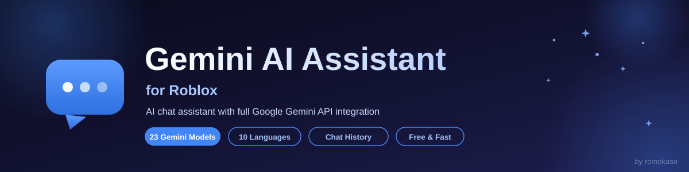

<a id="top"></a>

<div align="center">



[](https://opensource.org/licenses/MIT)
[](https://github.com/romokaso/Gemeni-AI/stargazers)
[](https://github.com/romokaso/Gemeni-AI/forks)
[](https://github.com/romokaso/Gemeni-AI/issues)
[](https://github.com/romokaso/Gemeni-AI/commits/main)
[](https://www.roblox.com/)
[](https://www.lua.org/)
[](https://ai.google.dev/)
[](https://github.com/romokaso/Gemeni-AI/issues)

**Powerful AI chat assistant for Roblox with full Google Gemini API integration — free, fast, and open source.**

[🚀 Quick Start](#quick-start) • [📥 Installation](#installation) • [🔑 API Key](#getting-api-key) • [🎮 Usage](#usage) • [🤖 Models](#available-models) • [🛠️ Troubleshooting](#troubleshooting) • [❓ FAQ](#faq) • [📈 Changelog](#changelog)

</div>

---

## 📋 Table of Contents

- [🚀 Quick Start](#quick-start)
- [✨ Features](#features)
- [📥 Installation](#installation)
- [🔑 Getting API Key](#getting-api-key)
- [🎮 Usage](#usage)
- [🔧 How It Works](#how-it-works)
- [🤖 Available Models](#available-models)
- [🌐 Supported Languages](#supported-languages)
- [⚙️ System Requirements](#system-requirements)
- [📸 Screenshots](#screenshots)
- [🛠️ Troubleshooting](#troubleshooting)
- [❓ FAQ](#faq)
- [🔒 Security](#security)
- [🗺️ Roadmap](#roadmap)
- [📊 Project Stats](#project-stats)
- [🤝 Contributing](#contributing)
- [📝 License](#license)
- [📈 Changelog](#changelog)
- [👤 Author & Support](#author--support)

---

<a id="quick-start"></a>
## 🚀 Quick Start

Get the assistant running in **under 2 minutes**:

| # | Step | Time |
| --- | --- | --- |
| 1 | **Get a free API key** at [aistudio.google.com/apikey](https://aistudio.google.com/apikey) | ~2 min |
| 2 | **Run the script** in your Roblox executor (one line) | ~10 sec |
| 3 | **Paste the key**, click **Confirm** and start chatting | ~10 sec |

```lua
loadstring(game:HttpGet("https://raw.githubusercontent.com/romokaso/Gemeni-AI/main/Gemini-AI"))()
```

<p align="right"><sub><a href="#top">⬆ Back to top</a></sub></p>

---

<a id="features"></a>
## ✨ Features

<table>
<tr>
<td width="33%">

### 🧠 Artificial Intelligence
- **23 Gemini models** — from lightweight to most powerful
- **Contextual memory** — AI remembers the entire conversation
- **Smart responses** — code, advice, problem solving
- **Fast typing animation** with response timer
- **Auto-switch model** on any API error

</td>
<td width="33%">

### 💬 Chat
- **Reply, Regenerate, Edit, Stop** — full message control
- **Code blocks** — copy with one click or **run directly** in the game
- **Thinking dots** while AI generates
- **Draft saving** — unfinished messages are never lost
- **Edit messages** after sending

</td>
<td width="33%">

### 🎨 Interface
- **Modern design** — stylish and user-friendly UI
- **2 themes** — dark and light
- **Smooth animations** — pleasant experience
- **Drag & Drop button** — move it anywhere
- **Hotkey** — press <kbd>Right Ctrl</kbd> to open/close

</td>
</tr>
<tr>
<td width="33%">

### 📂 Chat History
- **Save all conversations** automatically
- **Search** chats & messages
- **Pin chats** to the top of history
- **Preview, date and model** shown for each chat
- **Rename chats** and highlight messages

</td>
<td width="33%">

### 🔑 API Management
- **Multiple API keys** — easy switching
- **Key verification** before saving
- **How to get a key** guide built into the script
- **Error handling** — unexpected formats are caught
- **Script errors auto-copy to clipboard**

</td>
<td width="33%">

### 🌍 Localization
- **10 interface languages** — English, Russian and more
- **Full translation** — the entire interface
- **Quick switch** — in settings
- **Language remembered** after restart
- **AI answers in any language** you write in

</td>
</tr>
</table>

<p align="right"><sub><a href="#top">⬆ Back to top</a></sub></p>

---

<a id="installation"></a>
## 📥 Installation

### 🚀 Method 1: Loadstring (Recommended)

Copy and execute in any Roblox Executor:

```lua
loadstring(game:HttpGet("https://raw.githubusercontent.com/romokaso/Gemeni-AI/main/Gemini-AI"))()
```

### 📋 Method 2: Manual Installation

1. Open the script file: [`Gemini-AI`](https://github.com/romokaso/Gemeni-AI/blob/main/Gemini-AI)
2. Click the **Raw** button in the top right corner
3. Copy all the code (<kbd>Ctrl</kbd> + <kbd>A</kbd> → <kbd>Ctrl</kbd> + <kbd>C</kbd>)
4. Paste it into your Executor
5. Click **Execute / Inject**

### ⚡ Method 3: With Error Handling

```lua
local success, err = pcall(function()
    loadstring(game:HttpGet("https://raw.githubusercontent.com/romokaso/Gemeni-AI/main/Gemini-AI"))()
end)

if not success then
    warn("❌ Error loading Gemini AI:", err)
end
```

> ⚠️ **Note:** the script requires an executor with HTTP support (`request()` / `http_request()`). See [⚙️ System Requirements](#system-requirements).

<p align="right"><sub><a href="#top">⬆ Back to top</a></sub></p>

---

<a id="getting-api-key"></a>
## 🔑 Getting API Key

> ⚠️ **IMPORTANT:** without an API key the script **WILL NOT work**! Getting one is **free** and takes **2 minutes**.

### 📝 Step-by-step guide

| Step | What to do |
| --- | --- |
| **1. Open Google AI Studio** | Go to <https://aistudio.google.com/apikey> |
| **2. Sign in** | Click **Sign in** in the top right corner. No account? Create one — it's free |
| **3. Create API Key** | Click the blue **"Create API Key"** button, select an existing project or create a new one, wait a few seconds |
| **4. Copy the key** | Your key appears (starts with `AIza...`). Click **Copy** — and **never share it with anyone** |
| **5. Paste in the script** | Launch the script in Roblox, paste the key into the window, click **Confirm** — done! ✅ |

<details>
<summary>🎥 <b>Video tutorial</b></summary>

🎬 Video tutorial coming soon on YouTube.

💡 **Quick link:** <https://aistudio.google.com/apikey>

</details>

### 🔒 API Key Safety Tips

- ✅ The key is stored **locally** in `GeminiAI_Data.json` and sent only to the official Google API
- ❌ **Never** paste your key into public chats, videos or GitHub issues
- 🔑 Multiple keys are supported — if one hits a rate limit, add another one in settings

<p align="right"><sub><a href="#top">⬆ Back to top</a></sub></p>

---

<a id="usage"></a>
## 🎮 Usage

### 🎯 First Launch

1. Launch the script via loadstring or manually
2. Enter your API key in the window that appears
3. Click **Confirm** — the key is saved automatically
4. A floating button appears in the **top left corner** of the screen
5. Click the button (or press <kbd>Right Ctrl</kbd>) to open the chat
6. On the first launch you'll see the **changelog** and a hotkey notification

### 🖱️ Controls

| Action | Description |
| --- | --- |
| 🧊 Click button | Open / close the interface |
| ✋ Drag button | Move it to a convenient place |
| 📂 History | View, search, pin and rename saved chats |
| ⚙️ Settings | Change theme, language, API key |
| 🤖 Model | Select one of 23 Gemini models |
| ➖ Minimize | Minimize the window |
| ❌ Close | Close the interface (return to key selection) |

### ⌨️ Hotkeys & Shortcuts

| Key / Button | Action |
| --- | --- |
| <kbd>Right Ctrl</kbd> | Open / close the GUI |
| <kbd>Enter</kbd> (in input field) | Send message |
| 📋 Copy button (under message) | Copy text to clipboard |
| ▶️ Run button (under code block) | Execute the code right in the game |
| ▼ button (bottom right) | Scroll down |

### 💬 Chat Features

- **Send** — type a message and press <kbd>Enter</kbd>
- **Reply** — answer a specific message (it appears quoted in the input bar)
- **Regenerate** — get a new version of the AI's last answer
- **Edit** — fix your message after sending
- **Stop** — interrupt generation at any moment (you'll see "⏹ Generation stopped")
- **Copy** — one click copies any message or code block
- **Run** — execute AI-generated code blocks directly in the game
- **Drafts** — if you close the GUI with an unfinished message, it's restored when you come back

### 📂 Chat History

- **Auto-save** — every conversation is saved
- **New chat** — start fresh anytime
- **Rename** — give chats meaningful names
- **Pin** 📌 — keep important chats at the top
- **Search** — find chats and messages instantly
- **Preview** — see the date, model and a preview of the last AI answer

### ⚙️ Settings

| Setting | Options |
| --- | --- |
| 🌙 Theme | Dark / Light |
| 🌍 Language | 10 interface languages |
| 🔑 API Keys | Add / switch / delete keys |
| 🤖 Model | 23 Gemini models |

### 💬 Usage Examples

> 👤 **You:** Write a teleport script for Roblox
>
> 🤖 **Gemini:** Sure! Here's a simple teleport script:
>
> ```lua
> -- Teleport to a position
> local Players = game:GetService("Players")
> local player = Players.LocalPlayer
> player.Character.HumanoidRootPart.CFrame = CFrame.new(0, 50, 0)
> ```
>
> 💡 Tip: click the **copy** button under the code block, or **Run** to execute it right in the game!

> 👤 **You:** How to solve equation x² + 5x + 6 = 0?
>
> 🤖 **Gemini:** Let's solve this quadratic equation using the discriminant: D = 25 − 24 = 1, so x₁ = −2 and x₂ = −3...

> 👤 **You:** Translate "Hello World" to Japanese
>
> 🤖 **Gemini:** "Hello World" in Japanese is: こんにちは世界！

> 👤 **You:** Come up with a name for my space game
>
> 🤖 **Gemini:** Here are some ideas for your space game: *Starforge*, *Nebula Drift*, *Orbit Breakers*...

<p align="right"><sub><a href="#top">⬆ Back to top</a></sub></p>

---

<a id="how-it-works"></a>
## 🔧 How It Works

```
┌──────────────┐   request()    ┌────────────────────┐  generateContent  ┌─────────────────────┐
│  Roblox game │ ─────────────► │ Gemini AI Assistant │ ────────────────► │ Google Gemini API   │
│  (executor)  │ ◄───────────── │ (chat, models, ...) │ ◄──────────────── │ (generativelanguage │
└──────────────┘   JSON answer  └─────────┬──────────┘      JSON stream   │   .googleapis.com)   │
                                          │                               └─────────────────────┘
                                          │ readfile / writefile
                                          ▼
                              ┌─────────────────────────┐
                              │ GeminiAI_Data.json      │
                              │ settings + chat history │
                              └─────────────────────────┘
```

- **API endpoint:** `https://generativelanguage.googleapis.com/v1beta/<model>:generateContent`
- **Key verification:** the script checks the key against the API before saving it
- **Storage:** all data (keys, settings, history, drafts) is saved to `GeminiAI_Data.json` in the executor's workspace
- **Error handling:** on API errors the script automatically switches to another model and notifies you

<p align="right"><sub><a href="#top">⬆ Back to top</a></sub></p>

---

<a id="available-models"></a>
## 🤖 Available Models

All **23 Gemini models** supported by the script:

### 🏆 Pro Models (Most Powerful)
Best for complex tasks, programming, analysis

| Model | Model ID |
| --- | --- |
| ✨ Gemini 3.1 Pro CustomTools | `gemini-3.1-pro-preview-customtools` |
| ✨ Gemini 3.1 Pro | `gemini-3.1-pro-preview` |
| 🔬 Deep Research Pro | `deep-research-pro-preview-12-2025` |
| 💎 Gemini 3 Pro | `gemini-3-pro-preview` |
| 🌟 Gemini 2.5 Pro | `gemini-2.5-pro` |
| 🎯 Gemini Pro Latest | `gemini-pro-latest` |

### ⚡ Flash Models (Fast)
Balance of speed and quality for everyday tasks

| Model | Model ID |
| --- | --- |
| 🚀 Gemini 3 Flash | `gemini-3-flash-preview` |
| ⭐ Gemini 2.5 Flash | `gemini-2.5-flash` |
| 🌙 Gemini 2.5 Flash Lite Preview | `gemini-2.5-flash-lite-preview-09-2025` |
| 🌙 Gemini 2.5 Flash Lite | `gemini-2.5-flash-lite` |
| 📌 Gemini Flash Latest | `gemini-flash-latest` |
| 📍 Gemini Flash Lite Latest | `gemini-flash-lite-latest` |
| 🔷 Gemini 2.0 Flash 001 | `gemini-2.0-flash-001` |
| 🔷 Gemini 2.0 Flash | `gemini-2.0-flash` |
| 💠 Gemini 2.0 Flash Lite 001 | `gemini-2.0-flash-lite-001` |
| 💠 Gemini 2.0 Flash Lite | `gemini-2.0-flash-lite` |

### 🧪 Experimental
Test and special models

| Model | Model ID |
| --- | --- |
| 🍌 Nano Banana Pro | `nano-banana-pro-preview` |

### 🎨 Gemma Models (Open Source)
Google's open models of different sizes

| Model | Model ID |
| --- | --- |
| 🦾 Gemma 3 27B | `gemma-3-27b-it` |
| 💪 Gemma 3 12B | `gemma-3-12b-it` |
| 👍 Gemma 3 4B | `gemma-3-4b-it` |
| 🤏 Gemma 3 1B | `gemma-3-1b-it` |
| 🔹 Gemma 3N E4B | `gemma-3n-e4b-it` |
| 🔹 Gemma 3N E2B | `gemma-3n-e2b-it` |

### 📊 Model Comparison

| Family | Speed | Quality | Use Case |
| --- | --- | --- | --- |
| Pro | 🐢 Slow | ⭐⭐⭐⭐⭐ | Complex tasks, code, analysis |
| Flash | ⚡ Fast | ⭐⭐⭐⭐ | Daily conversations |
| Lite | 🚀 Very fast | ⭐⭐⭐ | Simple questions |

> 💡 **Tip:** if a model hits a rate limit or fails, the script **automatically switches** to another model and notifies you — no need to do anything manually.

<p align="right"><sub><a href="#top">⬆ Back to top</a></sub></p>

---

<a id="supported-languages"></a>
## 🌐 Supported Languages

Full interface translation in **10 languages**:

| 🌍 Language | Code | 🌍 Language | Code |
| --- | --- | --- | --- |
| English | `en` | Deutsch | `de` |
| Русский | `ru` | Italiano | `it` |
| Українська | `uk` | Português | `pt` |
| Español | `es` | Nederlands | `nl` |
| Français | `fr` | Polski | `pl` |

### 🔄 How to change the language?

1. Open **Settings** (⚙️)
2. Click on the current language
3. Select the desired language from the list
4. The language changes instantly!

> 💡 **Note:** the interface language affects the UI only. For AI responses in your language, just **write your messages in that language** — the AI will answer in the same language.

<p align="right"><sub><a href="#top">⬆ Back to top</a></sub></p>

---

<a id="system-requirements"></a>
## ⚙️ System Requirements

### ✅ Required Executor Functions

Your executor MUST support:

| Function | Purpose |
| --- | --- |
| `request()` or `http_request()` | API requests |
| `readfile()` | Reading saved data |
| `writefile()` | Saving settings |
| `isfile()` | File checking |
| `setclipboard()` | Text copying |

### 🎮 Compatible Executors

Tested and works on:

| Executor | Status | Note |
| --- | --- | --- |
| ✅ Synapse X | Works | Full support |
| ✅ Script-Ware | Works | Full support |
| ✅ KRNL | Works | Full support |
| ✅ Fluxus | Works | Full support |
| ✅ Electron | Works | Full support |
| ✅ Arceus X | Works | Full support (mobile) |
| ⚠️ JJSploit | Partial | Saving may not work |
| ❌ Old executors | Doesn't work | No HTTP support |

> ⚠️ **Note:** many classic executors (Synapse X, KRNL, etc.) have been discontinued. Any **modern executor** with the functions listed above works — the script only needs HTTP and file I/O.

### 💻 Technical Specifications

| Spec | Value |
| --- | --- |
| 📝 Language | Lua 5.1 |
| 🔌 API | Google Gemini Generative Language API (v1beta) |
| 🎨 UI | Custom Roblox Instances (no external assets) |
| 💾 Data format | JSON (`GeminiAI_Data.json`) |
| 📦 Script size | ~740 lines / ~110 KB |
| 🚀 RAM required | Minimal |
| 🌐 Works on | PC & mobile executors |

<p align="right"><sub><a href="#top">⬆ Back to top</a></sub></p>

---

<a id="screenshots"></a>
## 📸 Screenshots

| | |
| --- | --- |
| 🌙 Dark Theme | 🖼️ *Screenshot coming soon* |
| ☀️ Light Theme | 🖼️ *Screenshot coming soon* |
| ⚙️ Settings | 🖼️ *Screenshot coming soon* |
| 📂 Chat History | 🖼️ *Screenshot coming soon* |

> 🙏 Want to help? Add a screenshot and open a Pull Request!

<p align="right"><sub><a href="#top">⬆ Back to top</a></sub></p>

---

<a id="troubleshooting"></a>
## 🛠️ Troubleshooting

<details>
<summary>❌ <b>Script doesn't start</b></summary>

- Check your executor — it must support HTTP requests
- Enable HttpService in game settings (if possible)
- Try another executor from the [compatible list](#system-requirements)
- Restart Roblox and try again
- Check your internet connection — an active connection is required

</details>

<details>
<summary>🔑 <b>"Invalid API Key" / "API Error 400"</b></summary>

- **Check the key:**
  - Must start with `AIza`
  - Copied completely (usually ~39 characters)
  - No spaces at the start or end
- **Get a new key:** go to <https://aistudio.google.com/apikey>, create a new API key and paste it in the script
- **Check limits:** new keys have request limits — wait a few minutes if exceeded

</details>

<details>
<summary>⏱️ <b>"Rate limit reached" / Error 429</b></summary>

- **What is this?** You exceeded the API request limit
- **Automatic solution:** the script will auto-switch to another model — just wait for the message
- **Manual solutions:**
  - Wait 1–2 minutes and try again
  - Add a new API key in settings
  - Switch to a Lite model (fewer limits)

> ℹ️ **Gemini API free tier limits:** roughly 10–15 requests per minute and up to ~1,500 requests per day for Flash models (Pro models have much lower daily caps). Limits vary by model and change over time — check the official [rate limits page](https://ai.google.dev/gemini-api/docs/rate-limits) for current numbers.

</details>

<details>
<summary>💾 <b>Chat history doesn't save</b></summary>

- **Check executor functions:**
  ```lua
  print(writefile) -- Should output: function
  print(readfile)  -- Should output: function
  ```
- **Write permissions:** some executors require permissions — check executor settings
- **Try another executor:** JJSploit often doesn't support saving — use KRNL, Fluxus or others
- **Clear cache:** delete the `GeminiAI_Data.json` file (if it exists) and restart the script

</details>

<details>
<summary>🖼️ <b>Button doesn't appear</b></summary>

- Wait for loading — it may take 5–10 seconds
- Check the other corners — the button might be off-screen
- Restart the script
- Check the console for errors (F9 in Roblox)

</details>

<details>
<summary>🌐 <b>Language / theme doesn't change</b></summary>

This is normal! When changing language or theme:

- The GUI is completely recreated
- You return to the main screen
- This is done for proper application of changes

Your data is saved: chat history ✅, API keys ✅, selected model ✅

</details>

<details>
<summary>📱 <b>Other issues</b></summary>

| Problem | Solution |
| --- | --- |
| AI responds in English instead of another language | Language in settings affects only the UI, not the AI responses. Write in your language! |
| Takes long to respond / no response | Pro models think longer. Switch to Flash or Lite |
| "Unexpected response format" error | Try another model — some experimental models are unstable |
| Script closes when clicking ❌ | This is normal! ❌ closes the GUI and returns to the API key input. Use ➖ to minimize |

</details>

<details>
<summary>💬 <b>Still stuck? Need help?</b></summary>

If the problem is not solved:

1. 📝 Open an [Issue](https://github.com/romokaso/Gemeni-AI/issues)
2. 📋 Describe the problem in detail
3. 📎 Attach an error screenshot (if any)
4. 💻 Specify your executor

</details>

<p align="right"><sub><a href="#top">⬆ Back to top</a></sub></p>

---

<a id="faq"></a>
## ❓ FAQ

<details>
<summary><b>Is this script really free?</b></summary>

Yes! The script is free and open source (MIT License). The Google Gemini API has a free tier — a free API key works without a credit card. Limits apply (see [Troubleshooting](#troubleshooting)).

</details>

<details>
<summary><b>Can I get banned for using this?</b></summary>

Using executors and third-party scripts in Roblox may violate Roblox's Terms of Service and can result in account actions. This project is for **educational purposes** — use it at your own risk. The author is not responsible for any bans.

</details>

<details>
<summary><b>Which executor should I use?</b></summary>

Any executor that supports `request()`, `readfile()` and `writefile()`. Check the [compatible executors](#system-requirements) table. Many classic executors are discontinued — modern alternatives with the required functions work fine.

</details>

<details>
<summary><b>Where is my API key stored?</b></summary>

Locally, in the `GeminiAI_Data.json` file inside your executor's workspace. It is sent only to the official Google API (`generativelanguage.googleapis.com`). The script is open source — you can verify this yourself.

</details>

<details>
<summary><b>Do I need to enter the key every time?</b></summary>

No. The key is saved automatically and loaded on the next launch.

</details>

<details>
<summary><b>Can I use multiple API keys?</b></summary>

Yes! Add, switch and delete keys in Settings (⚙️). If one key hits a rate limit, add another one.

</details>

<details>
<summary><b>The AI answers in English. How do I make it answer in Russian?</b></summary>

The interface language affects only the UI. To get answers in Russian (or any other language), just write your messages in that language.

</details>

<details>
<summary><b>Does it work on mobile executors?</b></summary>

Yes — Arceus X and similar mobile executors with HTTP and file I/O support are compatible.

</details>

<p align="right"><sub><a href="#top">⬆ Back to top</a></sub></p>

---

<a id="security"></a>
## 🔒 Security

- 🔐 **Local storage** — API keys are stored only in `GeminiAI_Data.json` on your device
- 📡 **Official endpoint only** — requests go exclusively to `generativelanguage.googleapis.com`
- ✅ **Key verification** — keys are validated against the API before saving
- 👀 **Open source** — the entire script is public; you can inspect every line before running it
- 🚫 **Never share your key** — anyone with it can use your quota. If a key leaks, revoke it in Google AI Studio and create a new one

<p align="right"><sub><a href="#top">⬆ Back to top</a></sub></p>

---

<a id="roadmap"></a>
## 🗺️ Roadmap

Ideas and planned improvements:

- [ ] 🖼️ Real screenshots of the interface
- [ ] 🎬 Video tutorial on YouTube
- [ ] 💬 Export / import chats
- [ ] 🖼️ Image support (Nano Banana)
- [ ] 🎨 Custom accent colors
- [ ] 📝 Custom system prompt
- [ ] 🧪 More experimental models as they appear

> Have an idea? Suggest it in [Issues](https://github.com/romokaso/Gemeni-AI/issues)!

<p align="right"><sub><a href="#top">⬆ Back to top</a></sub></p>

---

<a id="project-stats"></a>
## 📊 Project Stats

[](https://star-history.com/#romokaso/Gemeni-AI&Date)

[](https://github.com/romokaso/Gemeni-AI/stargazers)
[](https://github.com/romokaso/Gemeni-AI/forks)
[](https://github.com/romokaso/Gemeni-AI/issues)

<p align="right"><sub><a href="#top">⬆ Back to top</a></sub></p>

---

<a id="contributing"></a>
## 🤝 Contributing

Want to help improve Gemini AI? Any contribution is welcome! 🌟

### 🐛 Report a bug

Found a bug?

1. Open an [Issue](https://github.com/romokaso/Gemeni-AI/issues)
2. Describe the problem
3. Attach a screenshot

### 💡 Suggest a feature

Have a feature idea?

1. Open an [Issue](https://github.com/romokaso/Gemeni-AI/issues)
2. Describe the feature
3. Explain why it's needed

### 🌍 Add a translation

Know another language?

1. Fork the repository
2. Add the translation
3. Open a Pull Request

### 📝 How to make a Pull Request

1. Fork the repository (click **Fork** in the top right corner)
2. Clone your fork:

   ```bash
   git clone https://github.com/YOUR_USERNAME/Gemeni-AI.git
   ```

3. Create a branch:

   ```bash
   git checkout -b feature/amazing-feature
   ```

4. Make changes and commit:

   ```bash
   git commit -m "Add amazing feature"
   ```

5. Push to your branch:

   ```bash
   git push origin feature/amazing-feature
   ```

6. Open a Pull Request on GitHub

### 📜 Rules

- ✅ Follow the project code style
- ✅ Test changes before submitting a PR
- ✅ Describe what changed and why
- ❌ Don't add malicious code
- ❌ Don't steal user API keys

<p align="right"><sub><a href="#top">⬆ Back to top</a></sub></p>

---

<a id="license"></a>
## 📝 License

This project is licensed under the **MIT License** — see the [LICENSE](LICENSE) file.

With the MIT License you can:

- ✅ Use commercially
- ✅ Modify the code
- ✅ Distribute
- ✅ Use privately
- ✅ Create forks

BUT you must:

- ⚠️ Include a copy of the license
- ⚠️ Credit the original author

### ⚠️ Disclaimer

**IMPORTANT! Read before using:**

- 📚 This project was created for **educational purposes**
- ⚖️ The author is not responsible for your use of the script
- ⚠️ The author is not responsible for Roblox bans

By using this script you agree to these terms!

<p align="right"><sub><a href="#top">⬆ Back to top</a></sub></p>

---

<a id="changelog"></a>
## 📈 Changelog

<details open>
<summary>🆕 <b>Latest Update (March 2026)</b></summary>

**❌ Deleted**
- Gemini Exp 1206 (not working)
- Gemini 2.5 Flash Preview (not working)

**🤖 New Models**
- Gemini 3.1 Pro CustomTools
- Gemini 3.1 Pro

**📌 New Features**
- Pin chats to the top of history
- Auto-switch model on any API error
- Stop generation shows a stopped message
- Draft saving
- Script errors auto-copy to clipboard

**🌍 Languages**
- 194 languages for AI responses
- Language search

**✨ Chat**
- Reply, Regen, Edit, Stop
- Fast typing + timer
- Code blocks: copy + run
- Thinking dots
- Edit messages

**🔍 History**
- Search chats & messages
- Preview, date, model
- Message highlight

**⌨️ Hotkey**
- <kbd>Right Ctrl</kbd> — open/close

**🔑 API**
- Multiple keys
- Switch / Add / Delete

**📋 Other**
- Sound, timer, drafts

</details>

<details>
<summary>📦 <b>v1.0.0 (February 17, 2025)</b></summary>

| Change | Details |
| --- | --- |
| ✨ First public release | Initial version |
| 🧠 23 Gemini models | Full model list |
| 🌍 10 interface languages | English, Russian and more |
| 💾 Chat history system | Auto-save conversations |
| 🔑 Multiple API key management | Easy switching |
| 🎨 Dark and light theme | Both themes |
| 🖱️ Drag & Drop button | Move it anywhere |
| 💾 Auto-save settings | Never lost |
| 📋 Message copying | One click |

</details>

<p align="right"><sub><a href="#top">⬆ Back to top</a></sub></p>

---

<a id="author--support"></a>
## 👤 Author & Support

<div align="center">

**Made with ❤️ by [romokaso](https://github.com/romokaso)**

[](https://github.com/romokaso)
[](https://github.com/romokaso/Gemeni-AI)

</div>

### 🌟 Support the Project

If the project helped you or you liked it:

- ⭐ **Star the repo** — helps others find the project
- 🔄 **Fork it** — create your own version
- 📢 **Tell friends** — share the link
- 💬 **Leave feedback** — write what you think

### 📞 Contact

Have questions? Contact me:

- 📧 GitHub Issues: [Create Issue](https://github.com/romokaso/Gemeni-AI/issues)
- 💬 Discussions: [Discussions](https://github.com/romokaso/Gemeni-AI/discussions)
- 🐛 Bug Reports: [Report Bug](https://github.com/romokaso/Gemeni-AI/issues/new)

---

<div align="center">

🎉 **Thank you for using Gemini AI!**

Made with ❤️ for the Roblox Community

[⬆ Back to top](#top)

</div>
